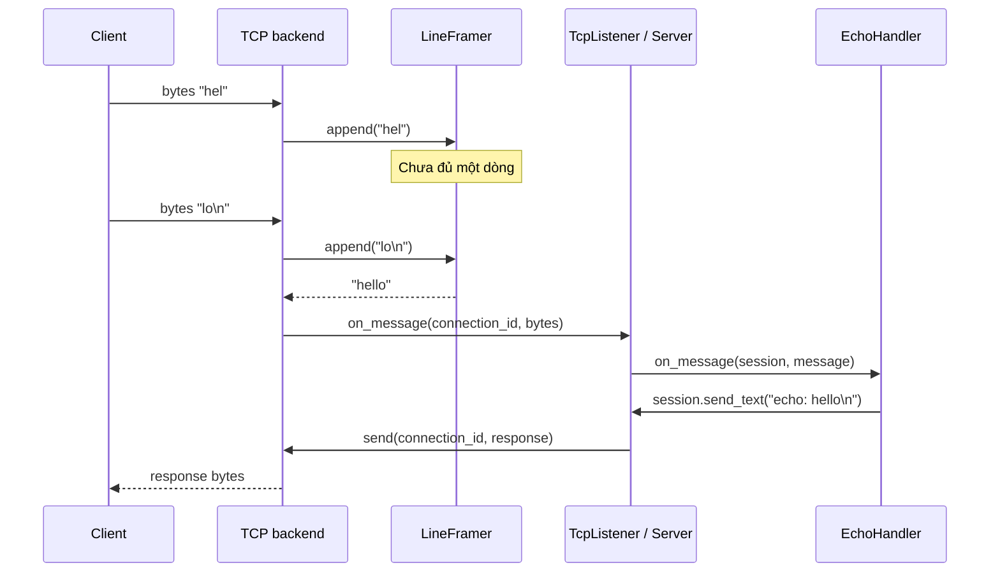
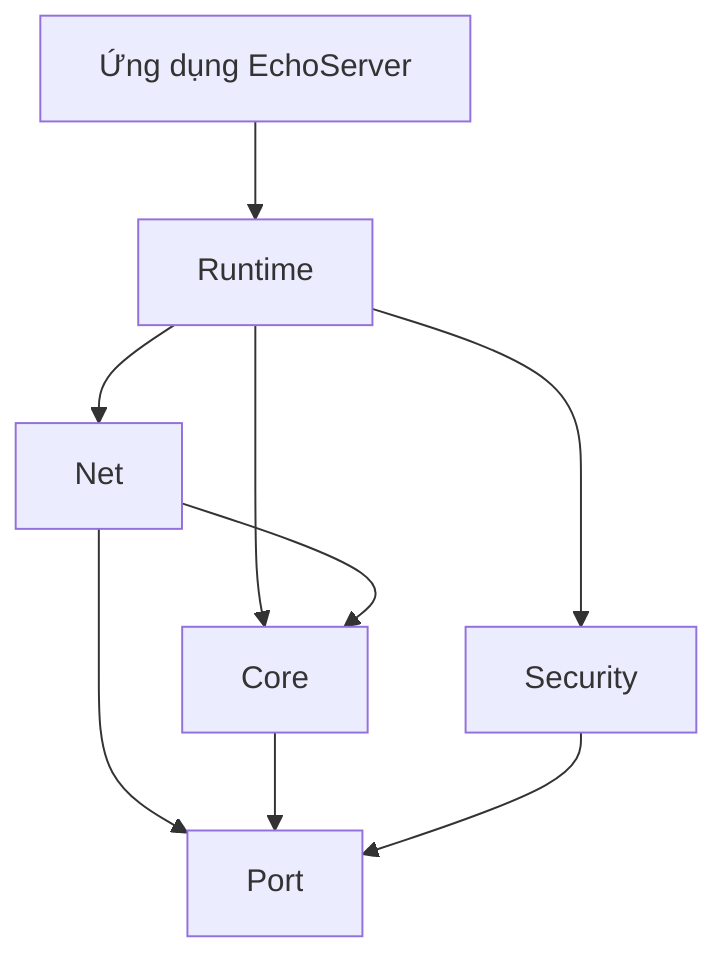

# Đọc ServerEngine từ một request

Tài liệu này mô tả API C++ tương thích cũ và backend IOCP/threaded. Với
`ServerEngine.dll` đa giao thức, bắt đầu ở [DLL quickstart](dll-quickstart.md)
và [kiến trúc DLL](dll-architecture.md). TCP theo dòng trong tài liệu này là
giao thức của ứng dụng cũ, không phải TCP binary length-prefix của DLL mới.

## Vì sao file cũ khó đọc?

Một file dài chưa đủ để kết luận là “god file”. Vấn đề là nhiều lý do thay đổi
khác nhau nằm chung chỗ. Trước refactor, sửa token, đổi cấu hình và thay luồng
khởi động đều dẫn đến `ServerEngine.cpp`. Trong backend TCP, socket, buffer,
worker và shutdown cũng nằm cùng một lớp lớn.

Tách tốt nghĩa là mỗi phần có một trách nhiệm có thể mô tả bằng một câu.
Số dòng chỉ là dấu hiệu để xem xét, không phải thước đo chất lượng.

## Đường đi của `hello`

Ví dụ trên giả sử session đã xác thực. Nếu chưa, handler trả `ERROR auth required`.
TCP có thể chia một lệnh thành nhiều lần đọc, hoặc gộp nhiều lệnh trong một lần
đọc. Vì vậy `recv()` hoàn thành không có nghĩa là đã có đủ message.

`LineFramer` giữ phần chưa đủ dòng và chỉ phát message khi thấy LF (`\n`).
Giới hạn `max_message_bytes` đếm từng dòng trước LF, gồm CR nếu dùng CRLF.
Một dòng vượt giới hạn làm kết nối bị đóng; lần đọc chứa dòng lỗi không được
dispatch. Phần còn dang dở khi client đóng socket cũng không được dispatch.

## Các lớp phụ thuộc theo hướng nào?

`Net` không include `EchoHandler` hay biết lệnh `WHO`.
Muốn dùng engine trong một ứng dụng khác, tạo lớp kế thừa `IMessageHandler`,
truyền handler đó vào `runtime::Server` và link `ServerEngineRuntime`.

Không cần thêm interface cho mọi lớp. `ITcpServer` có ý nghĩa vì đã có hai
backend; `IMessageHandler` có ý nghĩa vì ứng dụng thay được logic xử lý. Các
helper nội bộ là lớp cụ thể để người đọc có thể đi thẳng tới implementation.

## Ai sở hữu cái gì?

“Sở hữu” nghĩa là chịu trách nhiệm giữ đối tượng còn sống và giải phóng nó.

| Đối tượng | Chủ sở hữu | Kết thúc vòng đời |
| --- | --- | --- |
| Logger, handler, Server | Các biến local trong `app::run()` | Server bị hủy trước handler/logger |
| `TcpListener` | `Server`, qua `unique_ptr` | Sau khi backend dừng và join thread |
| TCP backend | `TcpListener`, qua `unique_ptr<ITcpServer>` | Khi listener bị hủy |
| `SessionRegistry`, `ConnectionHub` | `Server` | Sau tất cả listener |
| State kết nối | Backend và công việc I/O đang dùng nó | Khi không còn người dùng |
| `Session` truyền vào handler | View tạm trong callback | Khi callback kết thúc |

`unique_ptr` là một chủ sở hữu duy nhất. `shared_ptr` được dùng cho connection
khi registry và I/O đang chờ đều cần giữ nó còn sống. `shared_ptr` quản lý
thời gian sống, không tự bảo vệ dữ liệu khỏi race; dữ liệu dùng chung vẫn cần khóa.

Không lưu `Session&` hoặc bản copy của `Session` để dùng sau callback. Closure
gửi dữ liệu và con trỏ hub trong đó mượn tài nguyên của server. Public API hiện
tại chưa cung cấp handle gửi nền có vòng đời độc lập.

## Từng module làm gì?

### Ứng dụng mẫu

- `AppConfig`: đổi key INI thành cấu hình có kiểu và tập hợp cảnh báo.
- `Application`: lắp các thành phần, chạy và dừng chương trình.
- `StartupDiagnostics`: ghi thông tin môi trường/cấu hình khi bắt đầu.
- `EchoHandler`: nhận lệnh, kiểm tra quyền và tạo response.

Thêm một lệnh như `PING` tại `EchoHandler::on_message`, rồi thêm test tương ứng.
Không cần sửa worker hay socket. Khi số lệnh và nghiệp vụ lớn lên mới cân nhắc
tách bộ định tuyến lệnh; hiện tại vài nhánh rõ nghĩa dễ đọc hơn một framework.

### Runtime

`Server` quản lý listener và chặn exception từ handler ở biên callback.
`TcpListener` ánh xạ connection ID riêng của backend thành session ID của runtime.
`SessionRegistry` cấp ID chung cho tất cả listener và khóa thao tác kiểm tra
giới hạn + đăng ký. `ConnectionHub` lưu danh tính và thống kê có mutex riêng.

Ví dụ: listener A và B đều có connection số 1. Chúng cần hai session khác nhau
trong hub để tránh ghi đè trạng thái đăng nhập của nhau.

### TCP threaded

`TcpServer` là API công khai mỏng. `Threaded/TcpServerImpl` điều phối listener,
registry và thread; `ClientConnection` xử lý một client; `SocketOperations`
gom những khác biệt WinSock/POSIX.

Một client dùng một thread nhận dữ liệu. Gửi dữ liệu trên cùng connection được
tuần tự hóa. Disconnect đánh thức I/O bằng shutdown, còn đóng handle gắn với
vòng đời connection, tránh tái sử dụng descriptor khi thread khác còn dùng.
Luồng client đã xong được join và thu hồi ở lượt accept tiếp theo; shutdown
thu hồi phần còn lại. Listener dùng lần chờ có thời hạn để nhận biết yêu cầu
dừng, rồi mới đóng socket sau khi luồng accept đã kết thúc.

### TCP IOCP

`TcpIocpServer` che implementation Windows sau `unique_ptr` (cách làm này thường
được gọi là PImpl). Người dùng API không cần thấy `OVERLAPPED` và handle IOCP.

IOCP nhận thông báo rằng một thao tác I/O đã hoàn thành. Buffer và connection
của thao tác đó phải còn sống tới lúc completion được thu hồi, kể cả khi socket
đã được đóng. Một cờ `running=false` không đủ để chứng minh đã hết I/O.

Worker xử lý completion, connection giữ trạng thái nhận/gửi; completion port
quản lý hàng đợi hệ điều hành và số thao tác còn đang sống. Một send hoàn thành
có thể chỉ gửi một phần dữ liệu, nên phần còn lại phải được gửi tiếp trước
message kế tiếp trong hàng đợi của connection.

Một callback scope đánh dấu callback mở/nhận đang chạy. Nếu kết nối bị đóng
lúc đó, thông báo `on_disconnected` được hoãn tới khi callback hiện tại kết thúc.
Không giữ khóa trong lúc gọi handler. Nhờ vậy disconnect không vượt quá bước
đăng ký session và handler có thể gửi/ngắt kết nối mà không tự khóa chính nó.

## Quy tắc thread cần nhớ

1. `start()` / `stop()` / hủy server thuộc thread điều phối vòng đời, thường là
   thread chạy `main()`. Không gọi `stop()` ngay trong handler: có thể tự join
   thread đang chạy callback đó. Handler nên báo cờ/yêu cầu cho thread điều phối.
2. Nhiều connection có thể gọi chung handler đồng thời. Đừng thêm biến như
   `current_user_` vào handler dùng chung; danh tính nằm trong session/hub.
   Nếu dùng thẳng `ITcpServer`, raw `TcpServerCallbacks` không được để exception
   thoát ra. `runtime::Server` có biên bắt exception cho `IMessageHandler`.
3. Giữ khóa trong thời gian ngắn. Khi gọi code ứng dụng cần xem rõ khóa nào
   còn đang giữ; callback có thể gọi ngược `send()` hoặc `disconnect()`.
4. Shutdown phải ngừng accept, kết thúc connection và thu hồi công việc I/O,
   rồi join thread trước khi hủy callback state.

Dispatch kiểm tra cờ `running`; nếu thấy server đã dừng thì bỏ qua handler,
bao gồm `on_session_stopped` trong shutdown toàn server (giữ chính sách cũ).
Callback đã vượt qua bước kiểm tra vẫn có thể chạy tiếp trong lúc shutdown;
`stop()` chờ thread kết thúc trước khi trả về. Hub vẫn được dọn. Không dùng
callback đóng session làm nơi duy nhất giải phóng tài nguyên của app.

## Những thay đổi hành vi có chủ đích

- Session ID dùng chung toàn server; nhiều listener không còn ghi đè nhau.
- Admission kiểm tra và đăng ký cùng khóa để không vượt cap vì race giữa listeners.
- Giới hạn message tính theo dòng; nhiều dòng hợp lệ trong cùng lần đọc không
  bị từ chối chỉ vì tổng byte của lần đọc lớn.
- Log chỉ ghi số byte request/response, tránh ghi token trong `AUTH`.
- Khởi tạo session trước khi thread client bắt đầu nhận message.
- Backend có quyền sở hữu connection rõ hơn; IOCP thu hồi I/O trước khi kết thúc
  worker và xử lý send hoàn thành từng phần theo thứ tự.

Tên public method của Server/Session/ITcpServer được giữ. Layout lớp backend và
Server đã đổi, nên consumer C++ phải biên dịch lại với header/library cùng phiên
bản. Đây không phải cam kết tương thích ABI với binary cũ.

## Trước khi dùng cho tải production

Các thay đổi cấu trúc chưa chứng minh hiệu năng hay độ ổn định ở tải lớn. Cần
build và chạy trên từng backend, kiểm tra connect/disconnect dồn dập, client
đọc chậm, shutdown khi còn I/O, lỗi hệ điều hành và soak test.

Các phần còn thiếu cụ thể: TLS; giới hạn byte hàng đợi gửi IOCP và chính sách
backpressure; mô hình session dùng từ tác vụ nền; benchmark và kiểm thử lỗi/tải
tự động. Backend threaded dành cho luồng dễ hiểu và tải vừa; IOCP giảm nhu cầu
một thread cho mỗi client nhưng cần kiểm thử vòng đời nghiêm ngặt hơn.

Code chuyên nghiệp vẫn có giới hạn. Điều cần làm là chỉ ra giới hạn ở API và
test được những hợp đồng quan trọng, để người tiếp theo biết họ có thể dựa vào gì.
