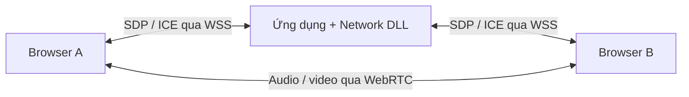

# Audio, video và stream đi qua Network thế nào?

Một file MP4, một packet game và một đoạn audio đều có thể biểu diễn thành
byte. Network truyền byte; việc hiểu nội dung thuộc protocol/codec của ứng dụng.
Gửi thành công một buffer MP4 không tự làm trình duyệt phát được video.

| Nhu cầu | Hướng sử dụng | Phần ngoài Network |
| --- | --- | --- |
| Gửi file audio/video đã ghi | HTTPS upload/download, chia khối có giới hạn, Range khi cần tua | Lưu file/object storage, metadata, checksum, quyền truy cập |
| Video call hoặc voice chat game | WebRTC cho media; WSS/HTTPS cho signaling | Capture, codec, jitter buffer, ICE/STUN/TURN; SFU nếu cần nhiều người |
| Livestream một nguồn cho nhiều người | Encoder/packager tạo HLS, phục vụ segment qua HTTP/CDN | Encode, bitrate ladder, playlist, segment, player |
| Native protocol riêng có độ trễ thấp | Cần protocol media hoàn chỉnh trên transport phù hợp | Timestamp, sequence, codec/keyframe, loss recovery, congestion control, bảo mật |

Không gửi cả file hàng GB trong một `se_server_send`. API hiện giới hạn message
và hàng đợi. HTTP mới cũng buffer request/response theo cap, **chưa có streaming
body, file response/Range hoặc HLS packager**. Demo `/api/echo` chỉ chuyển một
khối byte tối đa 16 KiB từ file do người dùng chọn; không lưu hoặc phát file đó.

## Ví dụ WebRTC đã có source

[WebMediaClient](../examples/WebMediaClient/index.html) và
[SignalRoom](../examples/WebServer/SignalRoom.cpp) minh họa rõ hai đường dữ liệu:

1. Người dùng bấm tham gia; browser xin quyền camera/microphone.
2. Hai browser mở WSS `/signal`, nhận vai trò tạo offer/answer.
3. DLL chuyển tiếp SDP/ICE dưới dạng binary WebSocket message. Host không
   parse SDP, cũng không tự chọn codec.
4. Browser thương lượng media và truyền qua WebRTC. Capture, encode/decode,
   xử lý độ trễ và bảo mật media do WebRTC đảm nhiệm.
5. Nút dừng/đóng trang dừng tracks, đóng peer connection và WSS.

Source serialize xử lý SDP/ICE, giữ ICE tới khi remote description sẵn sàng,
có giới hạn queue và heartbeat WSS. Khi một người rời, host kết thúc cả pairing
để signaling cũ không đi vào cuộc gọi mới.

Đây là signaling demo một phòng chung, không xác thực, tối đa hai người. Mở
hai tab trên cùng máy để kiểm tra sau build. Không cấu hình server bên thứ ba:
`iceServers: []`. Qua Internet thường cần STUN/TURN do bạn vận hành/cấu hình;
TURN relay và SFU không nằm trong DLL này. Demo chưa được chạy kiểm chứng.

WebRTC cho phép dùng WebSocket làm signaling mà không bắt buộc media đi qua
WebSocket. [MDN: signaling và video calling](https://developer.mozilla.org/en-US/docs/Web/API/WebRTC_API/Signaling_and_video_calling).
ICE quyết định đường kết nối khả dụng, có thể cần relay. [MDN: connectivity](https://developer.mozilla.org/en-US/docs/Web/API/WebRTC_API/Connectivity).

## Bảo mật và chất lượng stream

WSS ở demo dùng TLS 1.3 với chứng chỉ EC của engine. Media WebRTC có cơ chế
bảo mật riêng (DTLS-SRTP); nó không dùng trực tiếp listener UDP plaintext của
ServerEngine. [WebRTC Security Architecture](https://www.rfc-editor.org/rfc/rfc8827.html).

TLS không biến một phòng không xác thực thành phòng riêng. Sản phẩm thật cần
account, quyền tham gia, routing phòng, giới hạn số người và vòng đời session.
Đồng thời cần đo bitrate, packet loss, độ trễ và tài nguyên codec; không thể
suy ra khả năng chịu tải chỉ từ source gửi/nhận byte.

HLS phù hợp cho phân phối media qua hạ tầng HTTP, dùng playlist và segment do
packager tạo. Một HTTP endpoint trả MP4 chưa phải HLS. [Apple HLS](https://developer.apple.com/streaming/).
Với nhu cầu phát nhiều người, nên tích hợp media server/packager qua module
riêng hoặc service riêng khi đã xác định độ trễ và quy mô mong muốn.
