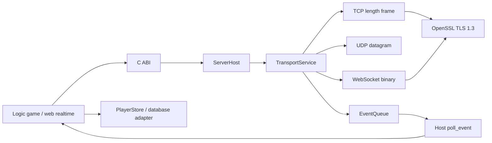

# Kiến trúc DLL: dễ trace từ host đến socket

Phần Network bên dưới hiện có thêm HTTP/HTTPS. Data SQL/Redis có vòng đời và
queue riêng, xem [kiến trúc hai module](network-and-data.md) và
[hợp đồng Data](data-services.md). Schema/query nghiệp vụ vẫn nằm trong host.

## Những nơi cần sửa khi thêm chức năng

| Muốn thay đổi | Bắt đầu ở |
| --- | --- |
| Hàm C ứng dụng gọi | `include/ServerEngine/C/ServerEngine.h`, `src/Abi/` |
| Vòng đời handle/event queue | `src/Runtime/Host/` |
| Cấu hình TLS/chứng chỉ | `src/Net/Async/TlsContext.cpp` |
| TCP binary framing | `src/Net/Async/TcpConnection.h` |
| Handshake/frame WebSocket | `src/Net/Async/WebSocketConnection.h` |
| UDP peer/datagram/idle | `src/Net/Async/UdpListener.*`, `UdpPeer.*` |
| Lệnh game, tên hiển thị | `examples/GameServer/GameServer.cpp` |
| Truy vấn SQL | `examples/GameServer/PlayerStore.cpp` |

Header TCP/WS chứa template để cùng một luồng logic dùng được socket thường
hoặc TLS stream. Chính sách chung nằm ở `ConnectionState`: timeout, báo open,
message và close. Không cần đọc nội bộ Boost để lần theo logic ứng dụng.

## Ai giữ tài nguyên sống?

- `HandleRegistry` giữ `shared_ptr<ServerHost>`. Token C là số, không phải địa
  chỉ bộ nhớ. Mỗi call lấy một shared_ptr trước khi nhả khóa registry.
- `ServerHost` sở hữu EventQueue và TransportService. Đóng transport trước
  khi queue mất hiệu lực.
- `TransportService` có một `io_context` và **một I/O worker cho mỗi handle**.
  Worker sở hữu registry của các peer TCP/UDP/WS và handshake đang thực hiện.
- Callback async giữ connection và buffer tới khi handler completion chạy,
  kể cả sau close. Context TLS sống lâu hơn SSL stream.
- Host sở hữu buffer poll và input send; DLL sao chép input cần giữ lại trước
  khi `send` trả về. Memory không đi qua cặp allocator khác DLL.

Không có application callback chạy trên worker. Public call start/send/stop
được serialize thành command và chờ worker xác nhận. `send` không đợi peer
nhận dữ liệu, nhưng có thể đợi worker xử lý lệnh enqueue; không phải API realtime
có cam kết latency cố định.

Không unload DLL khi còn handle, poller hoặc thread đang gọi API. Stop/destroy
mọi handle, join các thread của host đang dùng API rồi mới `FreeLibrary`.
Không khởi tạo networking từ `DllMain` hay static constructor của host.

## Trace một message

1. Client gửi bytes tới listener.
2. TCP ghép frame, WS ghép message, UDP giữ datagram.
3. Worker gọi `ServerHost` callback nội bộ để copy vào EventQueue.
4. Host poll nhận `sequence`, `listener_id`, `session_id`, payload.
5. Host thực hiện game logic hoặc gọi database adapter.
6. Host gọi `se_server_send(session_id, payload)`; DLL enqueue đúng transport.

ID của peer dùng chung giữa các listener trong một handle. ID không đại diện
account, không tồn tại qua restart và không tự liên kết người dùng giữa TCP
với UDP. `sequence` là thứ tự event của handle để trace, không phải thứ tự
toàn hệ thống phân tán hay bảo đảm UDP trên đường truyền.

## Giới hạn và shutdown

Hàng đợi event có cap số event và tổng payload bytes; metadata được chặn bởi
cap số event. Hàng đợi gửi có cap bytes và số message mỗi peer. TCP/WS giữ tối
đa 1024 message trong queue; UDP cũng chặn số datagram. Cap bytes gồm overhead
để message rỗng không lách giới hạn. Hãy tính tổng ngân sách theo số peer;
cap mỗi connection không có nghĩa toàn tiến trình chỉ dùng từng đó RAM.

Khi queue event quá tải, không giữ một lịch sử đã thiếu CLOSE. Queue chuyển
sang terminal overflow, từ chối dữ liệu mới; poll overflow sẽ stop/join engine.
Host cần bỏ state và tạo handle mới. Với game tick, poll thường xuyên và đưa
database chậm sang worker ứng dụng là cách tránh nghẽn queue.

Stop hủy listener/connection/timer, dừng nhận command mới, thu hồi cancellation
handler rồi join I/O worker. Nhánh lỗi cấp phát khi gửi lệnh stop có fallback
`io.stop + join + close`; instance transport đó không được restart. C ABI vốn
quy định stop là cuối vòng đời handle.

## Database và distribution mở rộng ở đâu?

Network vận chuyển bytes. Schema SQL, ý nghĩa transaction, room/shard ownership
và đồng bộ gameplay thuộc ứng dụng. `event → GameServer → PlayerStore` gọi Data
SQL service trong DLL; runtime queries chạy trên worker riêng và trả completion
về host. Chỉ migrations khởi tạo được đợi trước khi mở server.

MySQL/PostgreSQL cần driver SQL tương ứng (chưa có); Redis có API riêng cho
GET/SET/DELETE, không dùng câu SQL. Không block I/O worker để đợi database.
Không giữ con trỏ buffer của event cho tác
vụ nền; copy dữ liệu mà job cần và kiểm tra session còn hợp lệ khi trả kết quả.

Hướng distribution tiếp theo có thể là gateway → room owner → storage service.
Trước khi code cần xác định node discovery, account/session identity, định tuyến
shard, RPC timeout/retry, idempotency và chính sách khi node chết. Repo hiện chưa
có cluster membership, outbound client ABI, replication hoặc transaction phân
tán; không nên bật một cờ `distribution=true` rồi hiểu là đã có các bảo đảm đó.

Một worker/handle giúp ownership dễ đọc trong phiên bản này. Có thể mở nhiều
handle cho các shard độc lập; đây chưa phải bằng chứng scale tuyến tính. Khi
đo tải cho thấy cần, mở rộng executor theo shard mà vẫn giữ biên C ABI ổn định.

WS/WSS phục vụ web realtime. HTTP/HTTPS listener có API request/response riêng;
WebServer mẫu route các URL cố định và phục vụ hai asset được đọc lúc startup.
HTTP body còn được buffer theo cap, chưa có stream body/Range/file server tổng
quát, HTTP/2 hoặc HTTP/3. Đây chưa phải framework HTTP đầy đủ.

## Vì sao vẫn có IOCP/threaded cũ?

Đó là implementation C++ tương thích từ trước, hữu ích để học WinSock/IOCP và
chạy sample line-based cũ. DLL đa giao thức dùng Asio/Beast/OpenSSL để có frame
WebSocket và TLS chuẩn, cùng một mô hình event. [Beast được xây trên Asio và
cung cấp HTTP/WebSocket](https://www.boost.org/doc/libs/latest/libs/beast/doc/html/beast/using_websocket.html).
Không chạy hai backend cho cùng một listener. Đường DLL chính đã có bản đồ ở
đầu tài liệu; code cũ được đánh dấu rõ trong README để tránh trace nhầm.
