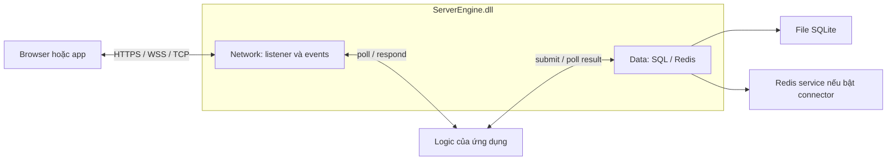

# Network và Data: đọc từ ứng dụng tới DLL

Source hiện có hai nhóm module liên kết vào một `ServerEngine.dll` công khai.
Ngày 05/09/2026, DLL và hai example đã được bạn build, sau đó đã thử một số
luồng HTTPS/SQLite và TCP/TLS/WSS trên loopback. Xem [trạng thái kiểm chứng](testing.md)
để phân biệt smoke check với bộ test đầy đủ và kiểm thử browser/tải.

| Module | Có trong source | Giới hạn hiện tại |
| --- | --- | --- |
| Network | TCP/TLS, UDP, WS/WSS, HTTP/1.1 và HTTPS | HTTP body có giới hạn và được buffer; chưa HTTP/2, HTTP/3, QUIC, DTLS |
| Data / SQL | SQLite chạy nền, tham số có kiểu, batch atomic, đọc kết quả | Một connection/worker mỗi service; chưa MySQL, ORM hoặc pool nhiều connection |
| Data / Redis | GET, SET với TTL, DELETE bất đồng bộ khi bật build option | Database 0, địa chỉ IP số, plaintext phải chọn rõ; chưa TLS, cluster, pub/sub |
| Media demo | WebRTC browser hai người; WSS chuyển SDP/ICE | Không SFU, TURN server, codec server, ghi hình hay phát cho nhiều người |
| Kafka | Chưa triển khai | Không có API giả nhận thành công |

## Bắt đầu từ ví dụ chạy xuyên suốt

Nếu chưa quen chạy server, xem [hướng dẫn từng bước](run-examples.md): file
`run-web-example.cmd` và `run-game-example.cmd` mở host trong cửa sổ console,
rồi bạn mở browser làm client. Các launcher không tự build hoặc tạo chứng chỉ.

Sau khi **bạn build thủ công** theo [quickstart](dll-quickstart.md) và chuẩn bị
chứng chỉ dev theo [security](security.md), chạy từ gốc repo:

```powershell
.\out\build\vs2022-x64-dll\Debug\ServerEngineWebServer.exe certs/server-cert.pem certs/server-key.pem
```

Mở `https://localhost:9553/`. Trang có ba phần:

1. GET `/api/profile` → Data SQLite đọc profile mẫu → JSON trả về browser.
2. POST `/api/echo` → gửi tối đa 16 KiB đầu của file audio/video → kiểm tra byte.
3. Hai tab tham gia một phòng chung → WSS signaling → WebRTC audio/video.

Web host bind loopback, tối đa 128 connection. HTTPS ở 9553, WSS ở 9554 path
`/signal`, TCP/TLS binary ở 9555 (PING/PONG hoặc echo). Profile chỉ là dữ liệu
demo công khai; phòng media chưa có account hoặc quyền riêng tư giữa người tham
gia. Chạy riêng khỏi game host cũ dùng 9443/9444/9001.

Network và Data đều được gọi qua public ABI. Host mẫu không include Boost,
OpenSSL, SQLite hoặc hiredis. [C++ wrapper](../include/ServerEngine/Cpp/Engine.h)
chỉ giúp giữ handle/result bằng RAII, được compile vào ứng dụng, không export
class C++ qua DLL.



Network không gọi trực tiếp database. Ứng dụng quyết định lúc nào cần truy vấn,
câu SQL nào cần chạy và ai được xem kết quả.

## Đường trace một yêu cầu web

Đọc theo thứ tự này:

| Nơi | Công việc |
| --- | --- |
| [WebServer/main.cpp](../examples/WebServer/main.cpp) | Cấu hình path, tạo host và dừng bằng Ctrl+C |
| [WebServer.cpp](../examples/WebServer/WebServer.cpp) | Poll network, route HTTP, liên kết HTTP request với SQL request |
| [ProfileStore.cpp](../examples/WebServer/ProfileStore.cpp) | Schema/query của profile, submit SQL |
| [Abi/Http.cpp](../src/Abi/Http.cpp) | Kiểm tra kiểu/buffer HTTP, gọi Network |
| [HttpConnection.h](../src/Net/Async/HttpConnection.h) | Parse request và ghi response HTTP đúng thứ tự |
| [Abi/Sql.cpp](../src/Abi/Sql.cpp) | Kiểm tra tham số SQL và trả dữ liệu qua caller buffer |
| [Data/Sql/Service.cpp](../src/Data/Sql/Service.cpp) | Admission, worker, completion và ownership kết quả |
| [SqliteDriver.cpp](../src/Data/Sql/SqliteDriver.cpp) | Thực thi transaction và rollback/cancellation |

Một HTTP request có ID riêng, ngoài session ID của connection. Khi kết quả SQL
về, host dùng bảng `sql_request → (session, http_request)` để trả đúng nơi.
Connection ngắt thì bỏ ánh xạ, nhưng vẫn poll/release kết quả SQL. ID request
HTTP cũ không thể trả lời request mới trên một connection keepalive.

Host poll cả hai queue trong một vòng lặp có giới hạn số kết quả mỗi lượt.
Network không chờ SQL; migration khởi tạo được đợi trước khi mở listener.
Thao tác file asset ở ví dụ được thực hiện một lần lúc startup, không đọc file
tùy ý dựa trên URL người dùng.

## API HTTP dùng thế nào?

Thêm listener `SE_PROTOCOL_HTTP`, security `SE_SECURITY_TLS` cho HTTPS. Poll
`SE_EVENT_HTTP_REQUEST` rồi gọi `se_http_request_read()` trên payload để lấy
method/target/headers/body qua offset. Những vùng đó thuộc buffer của host;
copy dữ liệu cần giữ qua lần poll tiếp theo.

Tạo `se_http_response` bằng initializer, đặt status/content_type/body rồi gọi
`se_http_respond(server, session, request_id, ...)`. Response thành công nghĩa
là đã vào queue gửi. Không gọi `se_server_send` cho HTTP session. Với HEAD,
truyền body giống GET để DLL tính Content-Length và tự bỏ body trên wire.

Body và toàn bộ request event phải vừa `max_message_bytes`; header giới hạn
16 KiB. Mỗi connection xử lý một request tại một thời điểm, giữ thứ tự
keepalive/pipelining. Protocol hiện chỉ nhận HTTP/1.1, không nhận CONNECT,
Expect/100-continue hoặc HTTP upgrade; WS dùng listener riêng.

HTTP routing thuộc ứng dụng. Vì vậy cùng Network module có thể dùng cho REST
endpoint, web realtime, game command hay app desktop. Việc xác thực, validate
JSON, CORS theo nhu cầu sản phẩm và luật game được viết phía host.

## Dùng Redis khi cần

Redis là connector tùy chọn. Chỉ cấu hình/build nếu cần; các lệnh sau do bạn chạy:

```powershell
cmake --preset vs2022-x64-dll -DSE_WITH_REDIS=ON
cmake --build --preset vs2022-x64-dll-debug
.\out\build\vs2022-x64-dll\Debug\ServerEngineRedisCache.exe --allow-plaintext 127.0.0.1 6379
```

CMake chọn feature `redis` của vcpkg trước khi toolchain xử lý manifest.
Ví dụ cần một Redis server bạn chuẩn bị riêng; nó SET một key demo có TTL,
GET và so sánh dữ liệu binary. Có thể lấy ACL username/password từ biến môi
trường `SE_REDIS_USERNAME`/`SE_REDIS_PASSWORD`. Connector hiện không mã hóa;
chỉ dùng đường truyền tin cậy/local hoặc một tunnel đã được cấu hình riêng.
Yêu cầu TLS bị từ chối, không tự chuyển sang plaintext.

Không bật feature thì public Redis API vẫn có, nhưng `se_redis_open` trả
`SE_NOT_SUPPORTED`. MySQL cũng chưa có driver thực thi trong phiên bản này.
Chi tiết ownership và giới hạn ở [data-services.md](data-services.md).
